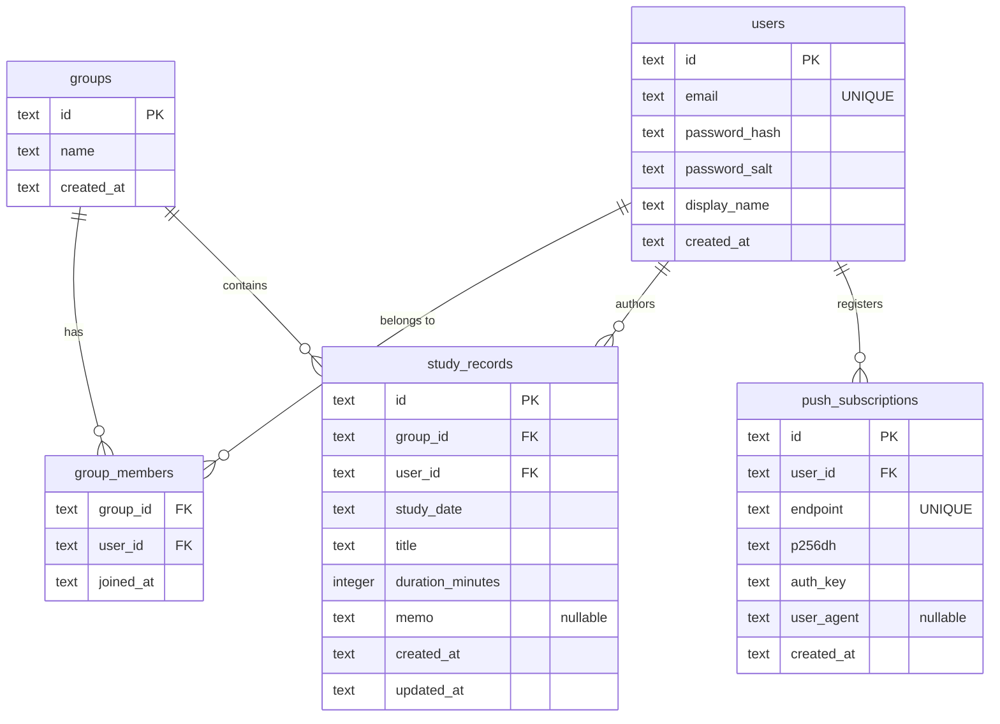

# shared-study-logger 機能ガイド

このスキルは、このリポジトリ（学習記録共有アプリ）で作業するエージェントが実装を隅々まで
読み直さなくても機能構成・データフロー・注意点を把握できるようにするためのものです。
より詳細な経緯や検証ログは以下を参照してください（本スキルはこれらの要点をまとめたもの）。

- [`README.md`](../../../README.md): セットアップ・デプロイ手順、環境変数一覧

## 全体アーキテクチャ

1つのCloudflare Workerで以下すべてを配信する単一デプロイ構成（`wrangler.jsonc`の`main`は
`src/worker/index.ts`）。

```
ブラウザ(React SPA + Service Worker)
  │  静的アセット取得
  ├─→ Static Assets (dist/client、SPAフォールバック)
  │  fetch /api/*
  └─→ Hono API ──→ D1 (users/groups/group_members/study_records/push_subscriptions)
                ├─→ Workers KV (SESSIONS: session:{token} -> {userId, expiresAt})
                └─→ Queue(PUSH_QUEUE: push-notifications) ─→ queue()ハンドラ ─→ D1で購読取得
                                                                            └─→ Web Push送信(VAPID)
```

- フロントとAPIが同一オリジンなのでCookie認証がシンプルで、CORS設定は不要。
- Push送信は投稿APIの中で同期実行せず、Queueへenqueueして`queue()`ハンドラ（同じWorkerスクリプト
  内でexport）が非同期に処理する。1メンバー1メッセージにすることで1回のコンシューマ呼び出しの
  処理量を小さく保つ設計（無料プランのCPU時間制限対策）。

### ディレクトリ構成（実装済み・設計ドキュメントの案とは命名が異なる点に注意）

Cloudflare公式テンプレートの命名規則を優先したため、設計ドキュメントの`worker/`・`src/`ではなく
`src/worker/`・`src/react-app/`になっている。

```
src/
  worker/                # バックエンド(Hono)
    index.ts              # fetch(Hono app) と queue() をexport
    routes/{auth,groups,records,push}.ts
    lib/{auth,db,push,session}.ts
    middleware/requireAuth.ts
    types/env.d.ts        # wrangler typesが生成しないシークレットの型補完
  react-app/             # フロントエンド(React)
    stores/uiStore.ts      # Zustand
    queries/*.ts           # TanStack Query hooks
    features/{auth,groups,records,push}/**
    components/Layout.tsx
    lib/{api,push}.ts
    main.tsx / App.tsx
shared/schemas.ts        # Zodスキーマ（Worker/フロント共通）
migrations/0001_init.sql # D1スキーマ
public/{sw.ts,manifest.webmanifest,icons/}
wrangler.jsonc            # D1/KV/Queueバインディング設定
vite.config.ts            # react() + cloudflare() + tailwindcss() + VitePWA(injectManifest)
```

## 機能ごとの整理

### 1. 認証・セッション

- **概要**: 固定アカウント方式（自己登録なし、管理者が事前にDBへ登録）。email/passwordで
  ログインし、Cookie(`session`)ベースのセッション認証を行う。
- **関連ファイル**:
  - Worker: `src/worker/lib/auth.ts`（PBKDF2ハッシュ生成・検証）、
    `src/worker/lib/session.ts`（KVセッションCRUD）、
    `src/worker/middleware/requireAuth.ts`（Cookie→KV検証→`c.set("user", ...)`）、
    `src/worker/routes/auth.ts`（`/login`,`/logout`,`/me`）
  - フロント: `src/react-app/features/auth/LoginPage.tsx`、
    `src/react-app/queries/useAuth.ts`（`useMeQuery`/`useLoginMutation`/`useLogoutMutation`）
  - 共通: `shared/schemas.ts`の`LoginRequestSchema`/`UserSchema`
- **データフロー**: `POST /api/auth/login` → email/passwordをzod検証 →
  `getUserByEmail`でD1照会 → PBKDF2(SHA-256, 100,000 iterations, 32byte, タイミングセーフ比較)で
  `verifyPassword` → 成功時`createSession`でKVに`session:{token}`→`{userId, expiresAt}`を
  TTL 30日で保存 → `Set-Cookie: session=...; HttpOnly; SameSite=Lax`。以降のリクエストは
  `requireAuth`ミドルウェアがCookieのトークンをKVで検証し`c.get("user")`にユーザー情報を載せる。
  フロントは起動時に`useMeQuery`(`GET /api/auth/me`)でログイン状態を判定し、401は例外にせず
  `null`を返す（`App.tsx`がこれで`LoginPage`/`Layout`を出し分け）。
- **注意点・既知の制約**:
  - Cookieの`secure`属性は`new URL(c.req.url).protocol === "https:"`で動的判定している
    （`src/worker/routes/auth.ts`）。`npm run dev`（HTTP配信）でもブラウザにログインCookieが
    保存されるようにするための開発体験目的の変更で、本番(Cloudflare、常にHTTPS)の挙動には
    影響しない。Cookie属性を触る変更をする際はこの判定式を壊さないよう注意。
  - パスワードハッシュのロジックは`src/worker/lib/auth.ts`と`scripts/seed-users.mjs`で
    **完全に同一**である必要がある（片方だけ変更するとログインできなくなる）。
  - 公開APIでのユーザー登録は存在しない。ユーザー追加は`scripts/seed-users.mjs`または
    直接SQL投入で行う運用。

### 2. グループ機能

- **概要**: ユーザーは1つ以上のグループに所属し、自分が所属するグループのメンバーの記録のみ
  閲覧できる。グループ作成/招待UIは無い（MVPスコープ外、DBへ直接投入する想定）。
- **関連ファイル**:
  - Worker: `src/worker/routes/groups.ts`（`GET /api/groups`）、
    `src/worker/lib/db.ts`の`getGroupsForUser`/`isUserInGroup`
  - フロント: `src/react-app/features/groups/GroupSwitcher.tsx`、
    `src/react-app/queries/useGroups.ts`（`useGroupsQuery`）、
    選択中グループIDは`src/react-app/stores/uiStore.ts`(Zustand)の`selectedGroupId`
- **データフロー**: `GET /api/groups`（`requireAuth`必須、`index.ts`で
  `app.use("/api/groups/*", requireAuth)`により一括適用）→ `group_members`をJOINして
  自分の所属グループ一覧を取得。フロントは取得後、`GroupSwitcher`が未選択または選択中グループが
  所属から外れていれば自動で先頭グループを選択する（`useEffect`）。所属グループが1件のみなら
  `<select>`ではなくグループ名のテキスト表示のみ。
- **注意点**: 記録一覧・投稿API（`records.ts`）は`groupId`ごとに毎回`isUserInGroup`で
  所属チェックを行っている。新しいグループ関連APIを追加する際も同様の所属チェックを忘れないこと
  （他グループの記録が閲覧・投稿できてしまう権限バグを防ぐため）。

### 3. 学習記録機能

- **概要**: 学習日・タイトル・学習時間（分）・メモ（任意）を投稿し、グループ内で新しい順に
  一覧表示する。一覧はカーソルページネーション。
- **関連ファイル**:
  - Worker: `src/worker/routes/records.ts`（`GET`/`POST /:groupId/records`）、
    `src/worker/lib/db.ts`の`listStudyRecords`/`createStudyRecord`
  - フロント: `src/react-app/features/records/RecordsList.tsx`（一覧表示、「もっと見る」）、
    `src/react-app/features/records/PostRecordModal.tsx`（投稿フォーム）、
    `src/react-app/queries/useRecords.ts`（`useInfiniteQuery`ベースの`useRecordsQuery`、
    `useCreateRecordMutation`）
  - 共通: `shared/schemas.ts`の`StudyRecordSchema`/`CreateStudyRecordRequestSchema`/
    `ListStudyRecordsQuerySchema`
- **データフロー**:
  - 一覧取得: `GET /:groupId/records?cursor=...&limit=...` → 所属チェック →
    zodでクエリ検証 → `listStudyRecords`が`created_at`+`id`を複合キーとした
    base64エンコードカーソル（`(created_at, id) < (cursor.created_at, cursor.id)`の比較）で
    `limit+1`件取得し、`limit`件を超えていれば`nextCursor`を返す。フロントは
    `useInfiniteQuery`の`getNextPageParam`で`nextCursor`をそのままページパラメータに使う。
  - 投稿: `POST /:groupId/records` → 所属チェック → zod検証 → `createStudyRecord`でD1へINSERT
    → 投稿者以外の全メンバーIDを`getOtherGroupMemberUserIds`で取得し、1人1メッセージを
    `PUSH_QUEUE`へenqueue（ベストエフォート、失敗しても投稿自体は201で成功させる）→
    フロントは`useCreateRecordMutation`の`onSuccess`で該当グループの一覧クエリキーを
    `invalidateQueries`し自動で再取得させる。
- **注意点・既知の制約**:
  - 記録の編集・削除APIは実装されていない（投稿のみ）。
  - `RecordsList.tsx`のレスポンシブ対応はTailwindの`sm:`ブレークポイントで単一コンポーネント
    内に両レイアウトを表現する方針（デバイス別の別実装は作らない、`Layout.tsx`も同様）。

### 4. Push通知機能

- **概要**: グループメンバーが記録を投稿すると、他のメンバーへWeb Push通知（VAPID方式）を送る。
- **関連ファイル**:
  - Worker: `src/worker/lib/push.ts`（`sendPushNotification`、`@pushforge/builder`の
    `buildPushHTTPRequest`を使用、`PushQueueMessage`型定義）、
    `src/worker/routes/push.ts`（`GET /vapid-public-key`,`POST/DELETE /subscribe`）、
    `src/worker/index.ts`の`queue()`ハンドラ（Queueコンシューマ本体）、
    `src/worker/lib/db.ts`の`getPushSubscriptionsForUser`/`upsertPushSubscription`/
    `deletePushSubscriptionByEndpoint`/`deletePushSubscriptionById`
  - フロント: `src/react-app/features/push/NotificationOptIn.tsx`（許可リクエスト～購読UI）、
    `src/react-app/queries/usePushSubscription.ts`、`src/react-app/lib/push.ts`
    （`urlBase64ToUint8Array`/`isIosNonStandalone`/`isPushSupported`）
  - Service Worker側: `public/sw.ts`の`push`/`notificationclick`/`pushsubscriptionchange`
    イベントハンドラ（同名の変換関数`urlBase64ToUint8Array`をSW内にも独立実装している。
    フロント側`lib/push.ts`と重複しているが、SWは別バンドルのため意図的な重複）
  - 共通: `shared/schemas.ts`の`PushSubscriptionSchema`（ブラウザの`PushSubscription.toJSON()`
    形式に合わせている）
- **データフロー**:
  1. `NotificationOptIn`のボタン押下（明示的なユーザー操作が必須、iOSの制約）→
     `Notification.requestPermission()` → 許可されたら`navigator.serviceWorker.ready`経由で
     `pushManager.subscribe({ applicationServerKey: VAPID公開鍵 })`
  2. 取得した`endpoint`/`p256dh`/`auth`を`POST /api/push/subscribe`でD1へupsert
     （`endpoint`をユニークキーとして同一端末からの再登録に対応）
  3. 記録投稿成功時、`records.ts`が投稿者以外の全メンバー分`PUSH_QUEUE`へenqueue
     （メッセージ形式は`PushQueueMessage`: `{ userId, notification: { title, body, data } }`）
  4. `index.ts`の`queue()`ハンドラがバッチ内の各メッセージについて`getPushSubscriptionsForUser`
     で対象ユーザーの全購読を取得 → `sendPushNotification`で各購読へVAPID署名+暗号化
     (aes128gcm)したペイロードをfetchでPOST → 成否に関わらず`message.ack()`（1メンバー1
     メッセージなので他メンバーへの影響を防ぐ設計）
  5. 送信結果が410/404の場合は`deletePushSubscriptionById`で該当購読をD1から自動削除
     （期限切れ購読のクリーンアップ）
  6. ブラウザのService Worker (`public/sw.ts`)が`push`イベントを受信し`showNotification()`、
     `notificationclick`で既存タブへフォーカス（`navigate`も試行）または`clients.openWindow('/')`
- **注意点・既知の制約**:
  - **iOSの制約**: PWAをホーム画面に追加（standaloneモード）していないとPush通知を受信
    できない。`isIosNonStandalone()`でUser-Agentベースに判定し、`NotificationOptIn`が
    「ホーム画面に追加」の案内を表示する。またiOSでは通知許可リクエストは直接的なユーザー操作の
    中でのみ機能する（ページ読み込み時の自動リクエストは不可）。
  - Push送信は「ベストエフォート」であり配信保証はない。Cloudflare Queuesの無料枠
    （1万オペレーション/日）を超えると失敗する点に留意。
  - `web-push`（Node製）はWorkers上で動作しないため使えない。VAPID実装は
    Web Crypto APIのみで完結する`@pushforge/builder`を採用している。代替ライブラリへの
    変更を検討する場合はWorkers対応（Node crypto非依存）であることを必ず確認すること。

### 5. PWA対応

- **概要**: ホーム画面への追加（インストール可能）、Service Workerによる静的アセットの
  プリキャッシュ、Push通知受信をサポート。
- **関連ファイル**: `vite.config.ts`（`VitePWA`設定）、`public/sw.ts`（カスタムService Worker
  ソース）、`public/manifest.webmanifest`、`public/icons/`、`index.html`
  （`<link rel="manifest">`等）、`src/react-app/main.tsx`（`/sw.js`の手動登録）
- **データフロー/ビルド**: `vite-plugin-pwa`を**`injectManifest`戦略**で使用
  （`generateSW`の自動生成では`push`/`notificationclick`の独自ハンドリングを追加できないため）。
  `srcDir: "public"`, `filename: "sw.ts"`, `manifest: false`（マニフェストは静的ファイルとして
  自前管理）, `injectRegister: false`（登録はmain.tsxで手動）。`npm run build`時に
  `public/sw.ts`がコンパイルされ、Workboxの`precacheAndRoute(self.__WB_MANIFEST)`で
  プリキャッシュ対象が注入された`dist/client/sw.js`が生成される（`sw.mjs`も出力されるが
  実際に登録されるのは`sw.js`）。
- **注意点**: `manifest.webmanifest`は`display: "standalone"`必須（iOSでPush通知を有効にする
  前提条件）。認証必須のデータアプリのため完全なオフライン編集は対象外（最小構成のキャッシュ
  のみ）。アイコンやマニフェストの内容を変更した場合、`vite.config.ts`の
  `injectManifest.globPatterns`に含まれているか確認すること。

### 6. フロント側の状態管理方針

- **Zustand（`src/react-app/stores/uiStore.ts`）**: クライアント状態専用。
  `selectedGroupId`（選択中グループ）、`isPostModalOpen`（投稿モーダル開閉）、
  `notificationStatus`を管理。サーバーから取得したデータをZustandに複製して持たない。
- **TanStack Query（`src/react-app/queries/*.ts`）**: サーバー状態専用。認証状態
  （`useAuth.ts`）、グループ一覧（`useGroups.ts`）、記録一覧・投稿
  （`useRecords.ts`、`useInfiniteQuery`）、Push購読状態（`usePushSubscription.ts`）の
  fetch・キャッシュ・invalidateをすべてここに集約する。ミューテーション成功時は関連する
  クエリキーを`invalidateQueries`して再取得させる方式で、キャッシュを手動で書き換える箇所は
  ログイン/ログアウト時の`authQueryKeys.me`への`setQueryData`のみ。
- **役割分担の指針**: 「APIから取得する/サーバーに保存されるデータ」はTanStack Query、
  「UIの一時的な見た目・操作状態」はZustand、という基準で迷ったら判断する。新機能追加時も
  この分担を踏襲すること（例: 新しいAPIリソースを追加する場合は`queries/`に新しいhookを
  作り、Zustandストアにサーバーデータを持たせない）。
- ルーティングライブラリは未導入（画面がログイン画面とメイン画面の2つのみのため、
  認証状態による条件分岐で切り替えている。`App.tsx`参照）。

## データモデル（D1 / SQLite、`migrations/0001_init.sql`）



- セッションはD1ではなく**Workers KV**（`SESSIONS`バインディング）に保存する
  （`session:{token}` → `{ userId, expiresAt }`）。
- インデックス: `group_members(user_id)`、`study_records(group_id, created_at DESC)`
  （カーソルページネーション用）、`study_records(user_id)`、`push_subscriptions(user_id)`。
- スキーマを変更する場合は`migrations/`に新しい番号のマイグレーションファイルを追加すること
  （既存の`0001_init.sql`は本番適用済みのため直接編集しない）。

## 主要APIエンドポイント一覧

| メソッド | パス | 認証 | 概要 |
| --- | --- | --- | --- |
| POST | `/api/auth/login` | 不要 | ログイン（email/password検証、セッションCookie発行） |
| POST | `/api/auth/logout` | 必要 | ログアウト（KVセッション削除、Cookieクリア） |
| GET | `/api/auth/me` | 必要 | ログイン中ユーザー情報取得 |
| GET | `/api/groups` | 必要 | 自分が所属するグループ一覧 |
| GET | `/api/groups/:groupId/records` | 必要+所属チェック | 記録一覧（カーソルページネーション、新しい順） |
| POST | `/api/groups/:groupId/records` | 必要+所属チェック | 記録投稿（成功時に他メンバーへPush enqueue） |
| GET | `/api/push/vapid-public-key` | 不要 | Push購読用のVAPID公開鍵取得 |
| POST | `/api/push/subscribe` | 必要 | Push購読情報の登録（upsert） |
| DELETE | `/api/push/subscribe` | 必要 | Push購読の解除 |

認証必須の適用箇所: `src/worker/index.ts`で`/api/groups/*`全体に`requireAuth`を一括適用し、
`/api/auth/logout`・`/me`と`/api/push/subscribe`は各ルートファイル内で個別に`requireAuth`を
適用している。新しいエンドポイントを追加する際はどちらの方式にするか`index.ts`を確認すること。

## ビルド・検証コマンド

```bash
npx tsc -b       # 型チェック（フロント/バックエンド両方、noEmit）
npm run build    # tsc -b && vite build（dist/client に静的アセット+SW、dist/shared_study_logger にWorkerバンドル）
npm run lint     # ESLint
npm run dev      # ローカル開発サーバー(Vite、ポート5173/使用中なら5174等に自動変更)
npm run seed     # scripts/seed-users.mjs（サンプルユーザー・グループ投入、ローカルD1向け）
```

- ローカルD1へのマイグレーション適用: `npx wrangler d1 migrations apply shared-study-logger-db --local`
- サンプルログイン: `admin@example.com` / `ChangeMe123!`

## 既知の制約・未完了事項

- **本番デプロイ未実施**: 本番シークレット(`VAPID_*`)の`wrangler secret put`設定、
  本番D1マイグレーション適用(`--remote`)、本番シード投入、`wrangler deploy`はすべて
  ユーザーの承認待ちで未実行。
- **ブラウザE2E確認が一部未完了**: 投稿モーダルの実クリック→一覧反映、通知許可プロンプトの
  表示、Push通知の実配信（2ユーザー・2端末）、iOS実機でのホーム画面追加・Push受信は
  いずれも未確認（ツール制約・実機なし）。これらに関わる変更を行う際は特に注意すること。
- **Cookie Secure属性の開発時対応**: 「認証・セッション」節参照。本番デプロイ後は
  `Set-Cookie`に`Secure`が付与されていることを確認することが推奨されている。
- **`@hono/zod-validator`は未導入**: 各ルートで`schema.safeParse(json)`による手動バリデーション
  を実装している（意図的な選択。挙動は同等）。新しいエンドポイントもこのパターンに合わせる。
- 初回git commitも本タスク時点では未実施（リポジトリ全体がuntrackedの可能性がある）。

## コードを変更する際に注意すべき設計判断（詳細は設計ドキュメントの「検討した代替案とその判断」参照）

- **Hono / D1を維持（FastAPI・PostgreSQLへの変更は見送り済み）**: Python Workers(FastAPI)は
  技術的に可能だが無料プランのCPU時間制限に対して不利かつコールドスタートが重く、
  ツールチェーンも二重化するため見送り。PostgreSQL(Hyperdrive経由)もエッジ配置の恩恵が薄れ
  運用対象が増えるため見送り、D1(SQLite)を維持している。**これらの技術選定を変更する提案を
  実装する際は、まずこの判断が既に検討済みであることを踏まえること**。
- **Zustand + TanStack Queryの併用**: ZustandだけではRTK Queryのようなサーバー状態
  キャッシュの仕組みが無いため、意図的に2ライブラリを併用している（役割分担は上記
  「フロント側の状態管理方針」参照）。片方に寄せる変更（例: サーバーデータをZustandに
  持たせる）は設計方針に反するため避けること。
- **`injectManifest`戦略を採用（`generateSW`ではない）**: `push`/`notificationclick`/
  `pushsubscriptionchange`の独自イベントハンドリングが必要なため。PWA設定を変更する際に
  `generateSW`に戻すとこれらのカスタムハンドラが失われる点に注意。
- **Push送信をQueueで非同期化**: 投稿APIのレスポンス自体のCPU時間・サブリクエスト数を
  圧迫しないための設計。投稿API内でPush送信を同期的に行う変更は無料プランの制限に抵触する
  リスクがあるため避けること。
- **1人1メッセージのenqueue方式**: 1メッセージの送信失敗が他メンバーへの通知に影響しない
  設計。バッチ処理の効率化のためにこれをまとめる変更をする場合は、この独立性が失われない
  設計にすること。

## 更新すべきタイミング

新しい機能追加（例: 記録の編集/削除、グループ管理UI、コメント機能等）、APIエンドポイントの
追加・変更、データモデルの変更、状態管理方針の変更、主要ライブラリの入れ替えを行った際は、
このSKILL.mdの該当セクション（機能ごとの整理・APIエンドポイント一覧・データモデル）を
あわせて更新すること。
