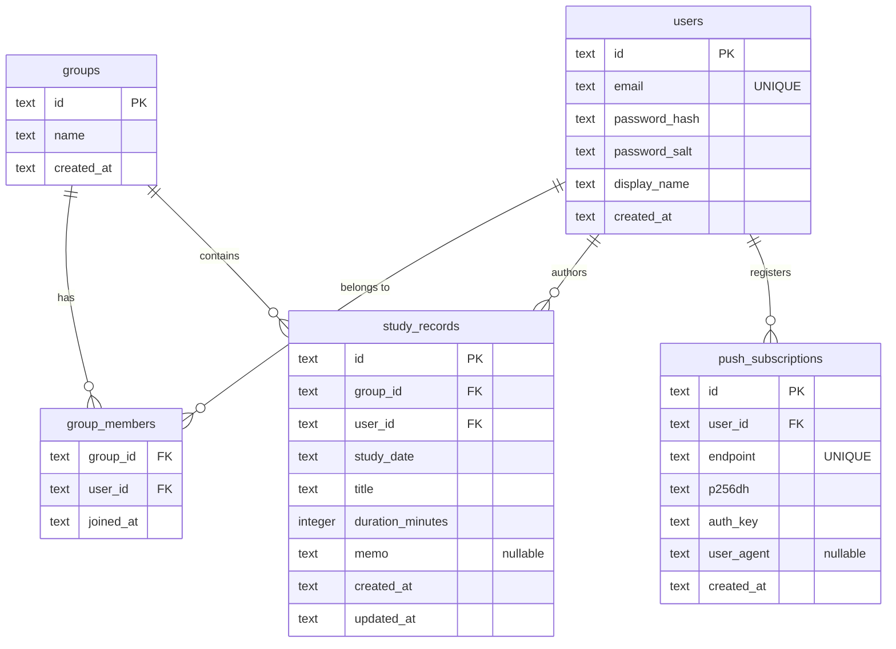

# shared-study-logger 機能ガイド

このスキルは、このリポジトリ（学習記録共有アプリ）で作業するエージェントが実装を隅々まで
読み直さなくても機能構成・データフロー・注意点を把握できるようにするためのものです。
横断的な情報（アーキテクチャ・データモデル・API一覧）は本ファイルにまとめ、機能ごとの
詳細（関連ファイル・データフロー・注意点）は`reference/`配下に分離しています。**作業対象の
機能に対応するreferenceファイルのみを読めば十分**です（他機能の詳細を読む必要はありません）。

より詳細な経緯や検証ログは以下を参照してください（本スキルはこれらの要点をまとめたもの）。

- [`README.md`](/README.md): セットアップ・デプロイ手順、環境変数一覧

## 全体アーキテクチャ

1つのCloudflare Workerで以下すべてを配信する単一デプロイ構成（`wrangler.jsonc`の`main`は
`src/worker/index.ts`）。

```
ブラウザ(React SPA + Service Worker)
  │  静的アセット取得
  ├─→ Static Assets (dist/client、SPAフォールバック)
  │  fetch /api/*
  └─→ Hono API ──→ D1 (users/groups/group_members/study_records/push_subscriptions)
                ├─→ Workers KV (SESSIONS: session:{token} -> {userId, expiresAt})
                └─→ Queue(PUSH_QUEUE: push-notifications) ─→ queue()ハンドラ ─→ D1で購読取得
                                                                            └─→ Web Push送信(VAPID)
```

- フロントとAPIが同一オリジンなのでCookie認証がシンプルで、CORS設定は不要。
- Push送信は投稿APIの中で同期実行せず、Queueへenqueueして`queue()`ハンドラ（同じWorkerスクリプト
  内でexport）が非同期に処理する。1メンバー1メッセージにすることで1回のコンシューマ呼び出しの
  処理量を小さく保つ設計（無料プランのCPU時間制限対策）。

### ディレクトリ構成（実装済み）

Cloudflare公式テンプレートの命名規則を優先し、バックエンドは`src/worker/`、
フロントエンドは`src/react-app/`という構成になっている。

```
src/
  worker/                # バックエンド(Hono)
    index.ts              # fetch(Hono app) と queue() をexport
    routes/{auth,groups,records,push}.ts
    lib/{auth,db,push,session}.ts
    middleware/requireAuth.ts
    types/env.d.ts        # wrangler typesが生成しないシークレットの型補完
  react-app/             # フロントエンド(React)
    stores/uiStore.ts      # Zustand
    queries/*.ts           # TanStack Query hooks
    features/{auth,groups,records,push}/**  # ドメイン固有ロジックを持つコンポーネント
    routes/                # react-router定義・認証ガード・404/HomePage
    components/{Layout,LoadingScreen}.tsx   # 横断的なUI（ドメインロジックを持つ）
    components/ui/{Button,FormField,ErrorMessage}.tsx  # ドメイン非依存の汎用UI部品
    lib/{api,push}.ts
    main.tsx / App.tsx     # App.tsxはRouterProviderを描画するだけの薄いラッパー
shared/schemas.ts        # Zodスキーマ（Worker/フロント共通）
migrations/0001_init.sql # D1スキーマ
public/{sw.ts,manifest.webmanifest,icons/}
wrangler.jsonc            # D1/KV/Queueバインディング設定
vite.config.ts            # react() + cloudflare() + tailwindcss() + VitePWA(injectManifest)
```

## 機能ごとの整理

各機能の関連ファイル・データフロー・注意点は個別のreferenceファイルにまとめている。作業内容に
対応するものだけを読むこと。

| # | 機能 | 概要 | 詳細 |
| --- | --- | --- | --- |
| 1 | 認証・セッション | 固定アカウント方式、Cookie(`session`)ベースのセッション認証 | [reference/auth.md](reference/auth.md) |
| 2 | グループ機能 | 所属グループのメンバーの記録のみ閲覧可能。作成/招待UIは無い | [reference/groups.md](reference/groups.md) |
| 3 | 学習記録機能 | 学習日・タイトル・時間・メモを投稿、カーソルページネーションで一覧表示 | [reference/records.md](reference/records.md) |
| 4 | Push通知機能 | 記録投稿時に他メンバーへWeb Push（VAPID）を送信 | [reference/push.md](reference/push.md) |
| 5 | PWA対応 | ホーム画面追加、Service Workerプリキャッシュ、Push受信 | [reference/pwa.md](reference/pwa.md) |
| 6 | 状態管理方針 | Zustand(クライアント状態) + TanStack Query(サーバー状態)の分担 | [reference/state-management.md](reference/state-management.md) |

## データモデル（D1 / SQLite、`migrations/0001_init.sql`）



- セッションはD1ではなく**Workers KV**（`SESSIONS`バインディング）に保存する
  （`session:{token}` → `{ userId, expiresAt }`）。
- インデックス: `group_members(user_id)`、`study_records(group_id, created_at DESC)`
  （カーソルページネーション用）、`study_records(user_id)`、`push_subscriptions(user_id)`。
- スキーマを変更する場合は`migrations/`に新しい番号のマイグレーションファイルを追加すること
  （既存の`0001_init.sql`は本番適用済みのため直接編集しない）。

## 主要APIエンドポイント一覧

| メソッド | パス | 認証 | 概要 |
| --- | --- | --- | --- |
| POST | `/api/auth/login` | 不要 | ログイン（email/password検証、セッションCookie発行） |
| POST | `/api/auth/logout` | 必要 | ログアウト（KVセッション削除、Cookieクリア） |
| GET | `/api/auth/me` | 必要 | ログイン中ユーザー情報取得 |
| GET | `/api/groups` | 必要 | 自分が所属するグループ一覧 |
| GET | `/api/groups/:groupId/records` | 必要+所属チェック | 記録一覧（カーソルページネーション、新しい順） |
| POST | `/api/groups/:groupId/records` | 必要+所属チェック | 記録投稿（成功時に他メンバーへPush enqueue） |
| GET | `/api/push/vapid-public-key` | 不要 | Push購読用のVAPID公開鍵取得 |
| POST | `/api/push/subscribe` | 必要 | Push購読情報の登録（upsert） |
| DELETE | `/api/push/subscribe` | 必要 | Push購読の解除 |

認証必須の適用箇所: `src/worker/index.ts`で`/api/groups/*`全体に`requireAuth`を一括適用し、
`/api/auth/logout`・`/me`と`/api/push/subscribe`は各ルートファイル内で個別に`requireAuth`を
適用している。新しいエンドポイントを追加する際はどちらの方式にするか`index.ts`を確認すること。

## ビルド・検証コマンド

```bash
pnpm exec tsc -b # 型チェック（フロント/バックエンド両方、noEmit）
pnpm build       # tsc -b && vite build（dist/client に静的アセット+SW、dist/shared_study_logger にWorkerバンドル）
pnpm lint        # ESLint
pnpm dev         # ローカル開発サーバー(Vite、ポート5173/使用中なら5174等に自動変更)
pnpm seed        # scripts/seed-users.mjs（サンプルユーザー・グループ投入、ローカルD1向け）
```

- ローカルD1へのマイグレーション適用: `npx wrangler d1 migrations apply shared-study-logger-db --local`
- サンプルログイン: `admin@example.com` / `ChangeMe123!`

## エディタ警告・コード品質

`tsc -b`やESLintでは検出されず、エディタ(Cursor/VSCode)上にだけ表示される型エラーや、
非推奨API・Tailwindのアービトラリバリューの扱いなど、コードレビュー・実装時に気を付けるべき
チェックリストは [reference/code-quality.md](reference/code-quality.md) にまとめている。
新しいディレクトリ/エントリーポイントの追加、Base64変換等のユーティリティ実装、
Tailwindのクラス指定を行う際は事前に確認すること。

## 既知の制約・未完了事項

- **本番デプロイ未実施**: 本番シークレット(`VAPID_*`)の`wrangler secret put`設定、
  本番D1マイグレーション適用(`--remote`)、本番シード投入、`wrangler deploy`はすべて
  ユーザーの承認待ちで未実行。
- **ブラウザE2E確認が一部未完了**: 投稿モーダルの実クリック→一覧反映、通知許可プロンプトの
  表示、Push通知の実配信（2ユーザー・2端末）、iOS実機でのホーム画面追加・Push受信は
  いずれも未確認（ツール制約・実機なし）。これらに関わる変更を行う際は特に注意すること。
- **Cookie Secure属性の開発時対応**: [reference/auth.md](reference/auth.md)参照。本番デプロイ後は
  `Set-Cookie`に`Secure`が付与されていることを確認することが推奨されている。
- **`@hono/zod-validator`は未導入**: 各ルートで`schema.safeParse(json)`による手動バリデーション
  を実装している（意図的な選択。挙動は同等）。新しいエンドポイントもこのパターンに合わせる。
- 初回git commitも本タスク時点では未実施（リポジトリ全体がuntrackedの可能性がある）。

## コードを変更する際に注意すべき設計判断

Hono/D1の維持、Zustand+TanStack Queryの併用、`injectManifest`戦略、Push非同期化など、既に
検討済みで見送った代替案がある。大きな技術選定やアーキテクチャの変更を提案・実装する前に
必ず [reference/design-decisions.md](reference/design-decisions.md) を確認すること。

## 更新すべきタイミング

新しい機能追加（例: 記録の編集/削除、グループ管理UI、コメント機能等）、APIエンドポイントの
追加・変更、データモデルの変更、状態管理方針の変更、主要ライブラリの入れ替えを行った際は、
このSKILL.mdおよび対応する`reference/*.md`の該当箇所をあわせて更新すること。同様に、
今回の`tsconfig.sw.json`新設のような「機能追加ではないがエディタ警告・コード品質に関する
知見」が得られた場合も、[reference/code-quality.md](reference/code-quality.md)に
チェックリストとして追記し、将来同種の問題が再発しないようにすること。
