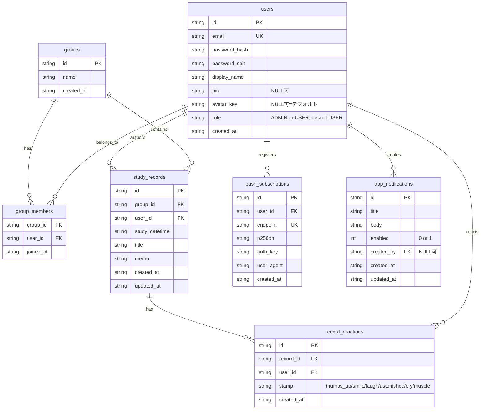

# データモデル

D1（SQLite互換）のスキーマ定義。マイグレーションの正本は [`migrations/`](../migrations/)（初期は
[`0001_init.sql`](../migrations/0001_init.sql)、以降の変更は番号付きマイグレーションを追加）。

## ER図

## 補足

- `users.email`・`push_subscriptions.endpoint` は UNIQUE 制約あり。`study_records.memo`・
  `push_subscriptions.user_agent`・`users.bio`・`users.avatar_key` は NULL 許可。
- `users.avatar_key` はプリセット画像のキー（例: `avoidy` / `lavender`）。許可リストは
  `shared/avatars.ts` の `AVATAR_KEYS`。`NULL` はクライアントで Lucide アイコン（デフォルト表示）。
- `users.role` は `ADMIN` または `USER`（CHECK 制約）。既存行・列省略時のデフォルトは `USER`。
  アプリからのロール変更 API は無い。管理者にする例:
  `UPDATE users SET role = 'ADMIN' WHERE email = 'admin@example.com';`
- ユーザーとグループの作成、グループへの所属追加/削除は ADMIN API
  （`/api/admin/users`・`/api/admin/groups`）から行える。公開の自己登録は無い。
  ユーザー削除・グループ削除の API は無い。
- `app_notifications` は管理者が作成するアプリ内通知。`enabled = 1` のものだけ
  `GET /api/notifications` で全ユーザーに返す。CRUD は ADMIN のみ。
- セッションは D1 ではなく **Cloudflare Workers KV**（`SESSIONS` バインディング）に保存する（`session:{token}` → `{ userId, expiresAt }`）。
- インデックス: `group_members(user_id)`、`study_records(group_id, study_datetime DESC, updated_at DESC, id DESC)`（カーソルページネーション用）、`study_records(user_id)`、`record_reactions(record_id)`、`push_subscriptions(user_id)`、`app_notifications(enabled, created_at DESC)`。
- `record_reactions` は学習記録へのスタンプ。同一ユーザーが同一記録に複数種類つけられる。同一ユーザー×同一スタンプは UNIQUE。記録削除時は CASCADE で消える。安定キーと表示絵文字の対応は `shared/schemas.ts` の `REACTION_STAMP_EMOJI`。
- スキーマを変更する場合は `migrations/` に新しい番号のマイグレーションファイルを追加すること。適用済みの migration はすべて不変とし、変更したい場合も新しい番号の migration を追加する（既存の `0001_init.sql` は本番適用済みの可能性があるため直接編集しない）。
  - `0004_user_profile.sql`: `users` に `bio` / `avatar_key` を追加。
  - `0005_user_roles.sql`: `users` に `role`（`ADMIN` / `USER`、DEFAULT `USER`）を追加。
  - `0006_app_notifications.sql`: `app_notifications`（アプリ内通知）を追加。
  - `0007_record_reactions.sql`: `record_reactions`（学習記録のリアクションスタンプ）を追加。
- 本番 D1 は SemVer タグ（`vX.Y.Z`）push 後の [`.github/workflows/ci.yml`](../.github/workflows/ci.yml) の production release で、Time Travel の migration 前復旧ポイントを記録してから apply する。同じ job が migration 完了後に Worker をデプロイするため、Worker が新スキーマを先行して参照しない。`main` へのマージだけでは本番 D1 は更新されない。
- rename / drop / NOT NULL 化などの破壊的変更は、旧 Worker と共存できる追加変更（expand）と旧スキーマを削除する変更（contract）を別リリースに分ける。Worker のロールバックでは D1 スキーマは戻らないため、必要時は release summary の Time Travel bookmark を使う。
