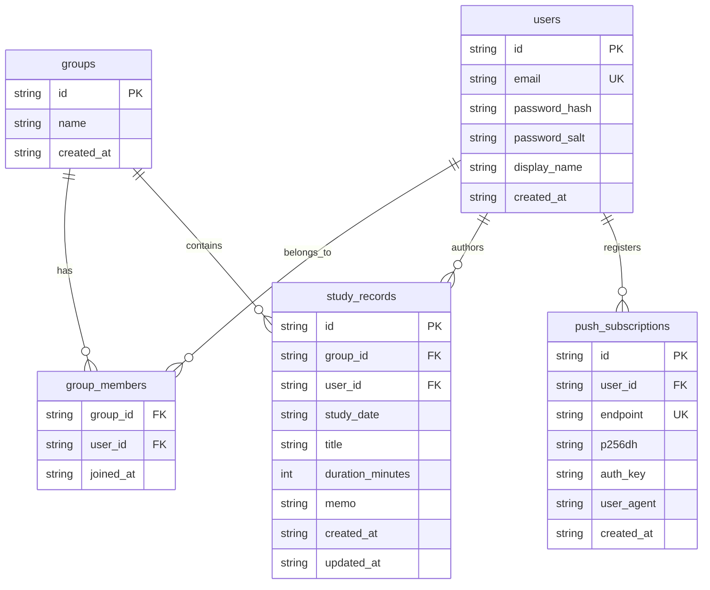

# データモデル

D1（SQLite互換）のスキーマ定義。マイグレーションの正本は [`migrations/0001_init.sql`](../migrations/0001_init.sql)。

## ER図

## 補足

- `users.email`・`push_subscriptions.endpoint` は UNIQUE 制約あり。`study_records.memo`・`push_subscriptions.user_agent` は NULL 許可。
- セッションは D1 ではなく **Cloudflare Workers KV**（`SESSIONS` バインディング）に保存する（`session:{token}` → `{ userId, expiresAt }`）。
- インデックス: `group_members(user_id)`、`study_records(group_id, created_at DESC)`（カーソルページネーション用）、`study_records(user_id)`、`push_subscriptions(user_id)`。
- スキーマを変更する場合は `migrations/` に新しい番号のマイグレーションファイルを追加すること（既存の `0001_init.sql` は本番適用済みの可能性があるため直接編集しない）。
