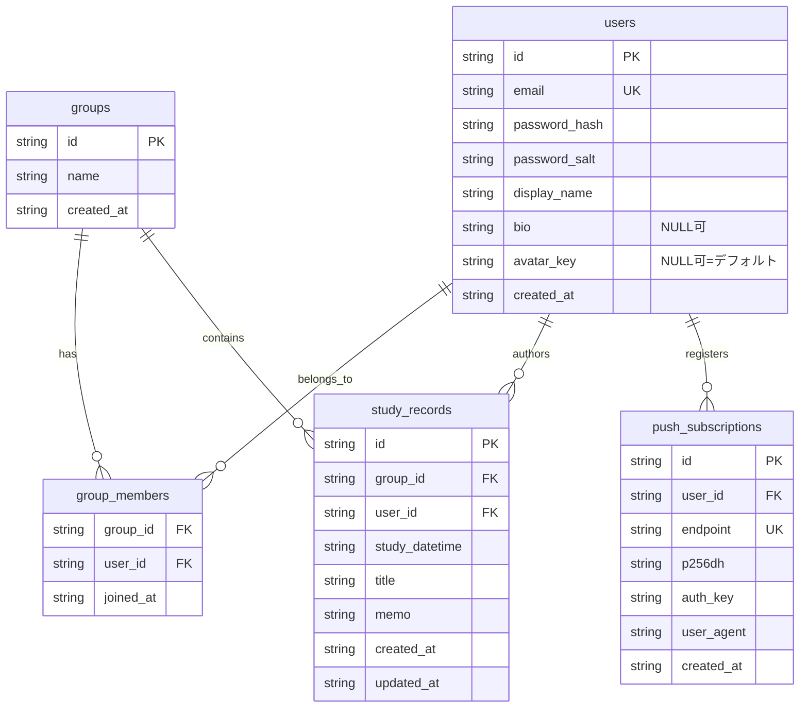

# データモデル

D1（SQLite互換）のスキーマ定義。マイグレーションの正本は [`migrations/`](../migrations/)（初期は
[`0001_init.sql`](../migrations/0001_init.sql)、以降の変更は番号付きマイグレーションを追加）。

## ER図

## 補足

- `users.email`・`push_subscriptions.endpoint` は UNIQUE 制約あり。`study_records.memo`・
  `push_subscriptions.user_agent`・`users.bio`・`users.avatar_key` は NULL 許可。
- `users.avatar_key` はプリセット画像のキー（例: `avoidy` / `lavender`）。許可リストは
  `shared/avatars.ts` の `AVATAR_KEYS`。`NULL` はクライアントで Lucide アイコン（デフォルト表示）。
- セッションは D1 ではなく **Cloudflare Workers KV**（`SESSIONS` バインディング）に保存する（`session:{token}` → `{ userId, expiresAt }`）。
- インデックス: `group_members(user_id)`、`study_records(group_id, study_datetime DESC, updated_at DESC, id DESC)`（カーソルページネーション用）、`study_records(user_id)`、`push_subscriptions(user_id)`。
- スキーマを変更する場合は `migrations/` に新しい番号のマイグレーションファイルを追加すること（既存の `0001_init.sql` は本番適用済みの可能性があるため直接編集しない）。
  - `0004_user_profile.sql`: `users` に `bio` / `avatar_key` を追加。
